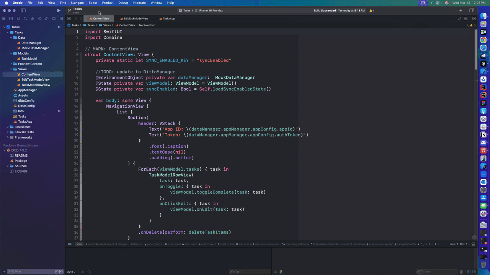

# Lab 2:  Register Observer - Swift UI iOS Application

The Ditto Manager provides a `@Published` property `tasks` which is an array of `TaskModel` objects.  

```swift
@Published var tasks = [TaskModel]()
```
Our UI in the app responds to changes in this property to update and draw the list of tasks.  We can use the observer to update the `tasks` property when the data in the task collection changes for any reason, like when a task is added, updated, or deleted from your device or other devices that have the app installed.

Find the [`registerObservers()`](../../swift/Tasks/Data/DittoManager.swift#L156) function in the [`DittoManager.swift`](https://github.com/ditto-examples/ditto-university/blob/main/course-101/swift/Tasks/Data/DittoManager.swift#L156) file.  This is the place to populate the task collection with data.  

The existing code should look like this:

```swift
    func registerObservers() throws {
        if let dittoInstance = ditto {
            
            //
            //TODO: - setup observer query, filter out NOT deleted
            //
            
            //UPDATE CODE HERE
            
            //
            //TODO: - setup store observer with query and set array with TaskModel
            //
            
            //UPDATE CODE HERE
        }
    }
}
```

Let's replace this TODO:

```
//
//TODO: - setup observer query, filter out NOT deleted
//

//UPDATE CODE HERE
```

Update the code:  Create a new variable `observerQuery` to store the DQL `SELECT` statement.  

```sql
let observerQuery = "SELECT * FROM tasks WHERE NOT deleted"
```

Note this uses a special key word `NOT` to filter out tasks that aren't deleted.  This means our app will observer the task collection and update when any task is added, or updated - as long as the delete property is set to false.  Now we we need to update the second TODO to register the observer with the query. 

We can use the registerObserver method to set up an observer within the store namespace enclosed with a query that specifies the collection to watch for changes, as well as your logic to handle the incoming changes.  Our logic is to update the `tasks` property with the new task data.   

Our DittoManager class already has a variable called storeObserver, which we can use to store a reference to the registered observer. 

```swift
var storeObserver: DittoStoreObserver?
```

Locate the following lines of code in the `registerObservers()` function:
```swift
//
//TODO: - setup store observer with query and set array with TaskModel
//
            
//UPDATE CODE HERE
```

Update the Code:  Replace this TODO with the following code:

```swift
storeObserver = try dittoInstance.store.registerObserver(query: observerQuery)
{ [weak self] results in
   Task { @MainActor in
     // Create new TaskModel instances and update the published property
     self?.tasks = results.items.compactMap{
       TaskModel($0.jsonString())
    }
  }
}
```

Let's break down the code changes:
- The first line creates a store observer that:
	- Listens for any changes to the tasks that match the `observerQuery` variable created in the previous step
	- When changes occur, it runs a closure

The closure does the following:
- Uses weak self to avoid retain cycles
- Runs the update on the main actor to ensure thread-safe UI updates
- Converts the Ditto results to TaskModel instances using compactMap, storing the new data in the `tasks` property
- The `tasks` property is an `@Published` variable, so any UI components that depend on it will automatically update when the data changes

## Update the App to use the DittoManager instead of the MockDataManager

In order to test our new changes, we need to update the app to use the `DittoManager` instead of the `MockDataManager`.  This will allow us to test the app with real data from Ditto.  In order to do this, we need to update several files by replacing the `MockDataManager` with `DittoManager`.  You can use the `Find and Replace` feature found in the `Find` menu in Xcode to update the files.  



Here are the files you need to update:

- ContentView.swift (3 places)
- EditTaskModelView.swift (3 places)
- TasksApp.swift (2 places)

## Run the App

You can now run the app and test the new functionality.  The app should now show a list of tasks that are not deleted that we populated in the previous lab when we updated the `populateTaskCollection` function.  Note that while the app will show you a list of tasks, we haven't added the functionality to add, update, or delete tasks yet. We will do that in the next lesson. 

[Return to the lesson](../README.md) to continue.